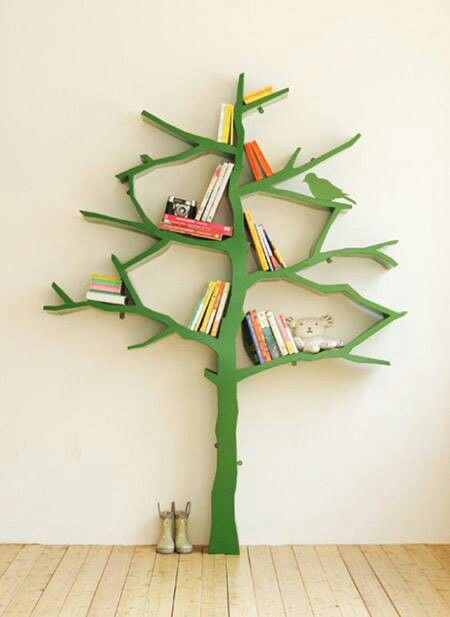
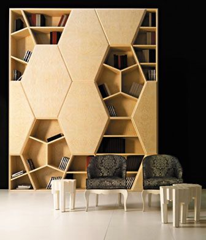
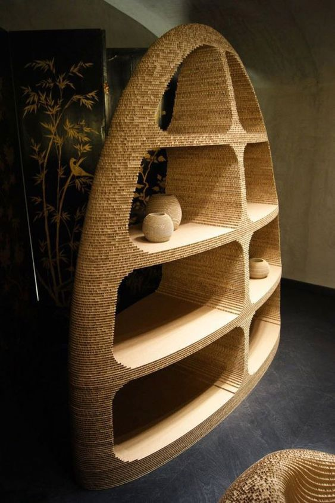
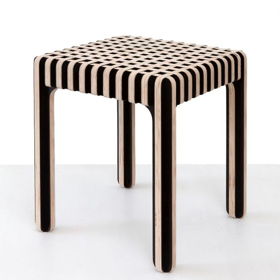
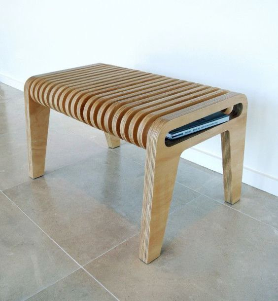

### Een behang serie shapes and light by [Jean-Marc Denis](http://jmd.im/black)

I used a poly reduction on the mesh as a proxy to be able to create my studio setup with a responsive viewport. I used a simple 2 point lighting setup. I created a roughness map using the height map to get the exact results I was looking. After that, I applied my material to the high poly mesh and used a subtle smoothing deformer for the creases.

This is the final render.

