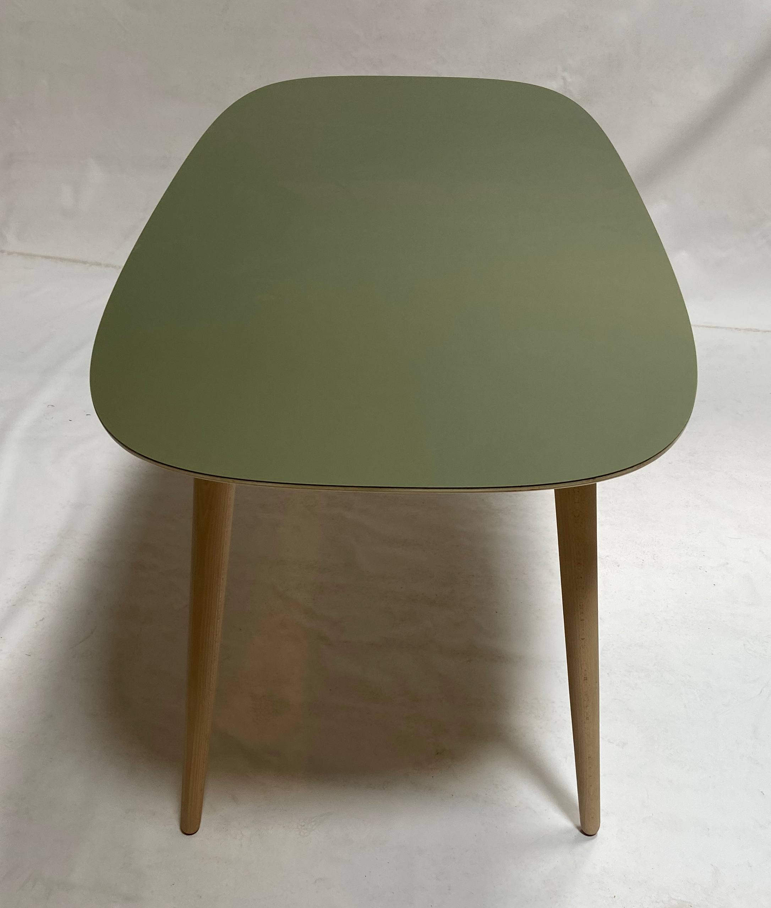
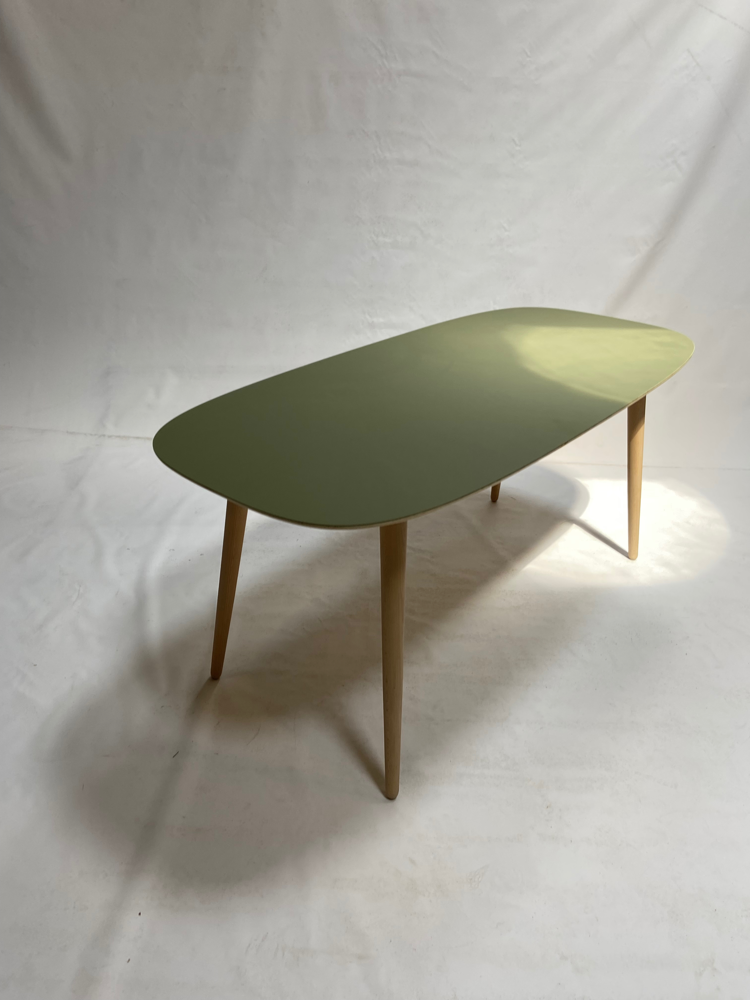
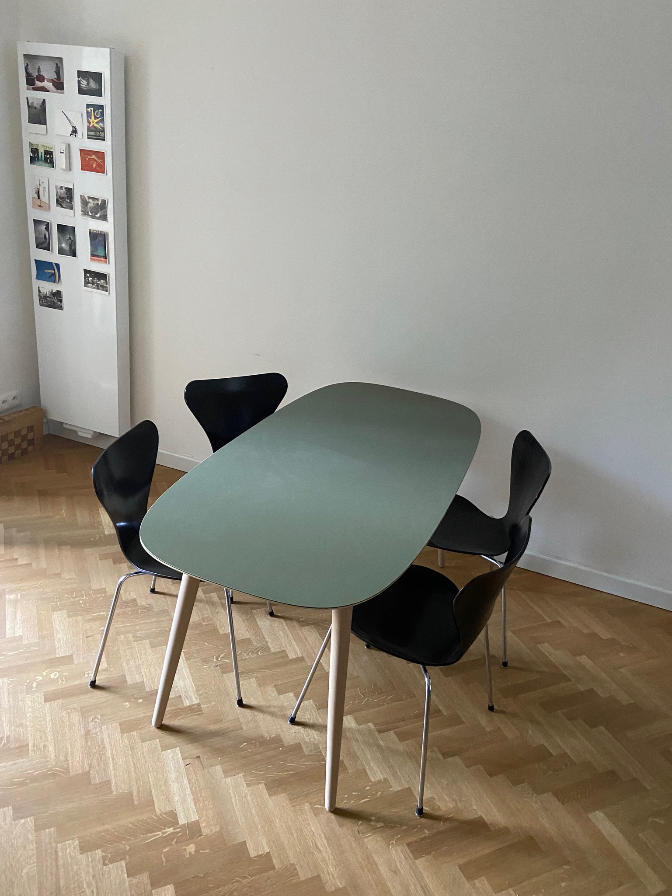
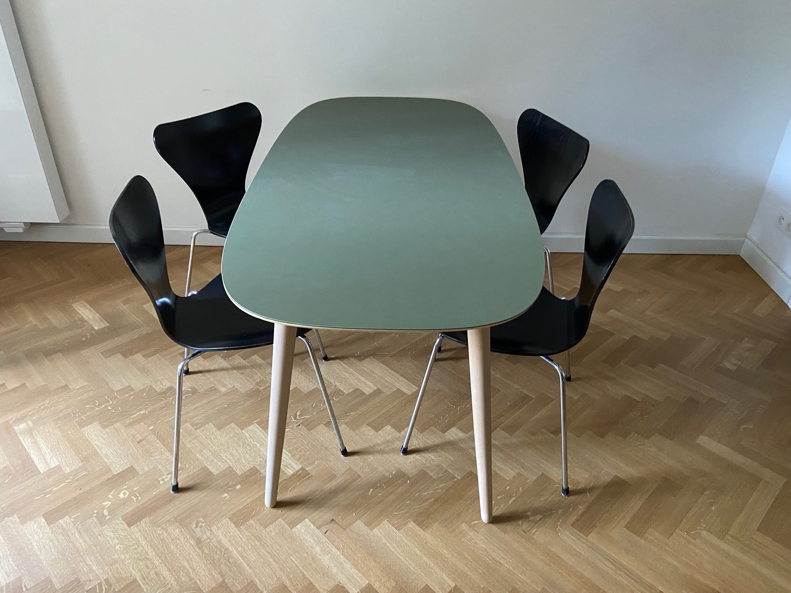
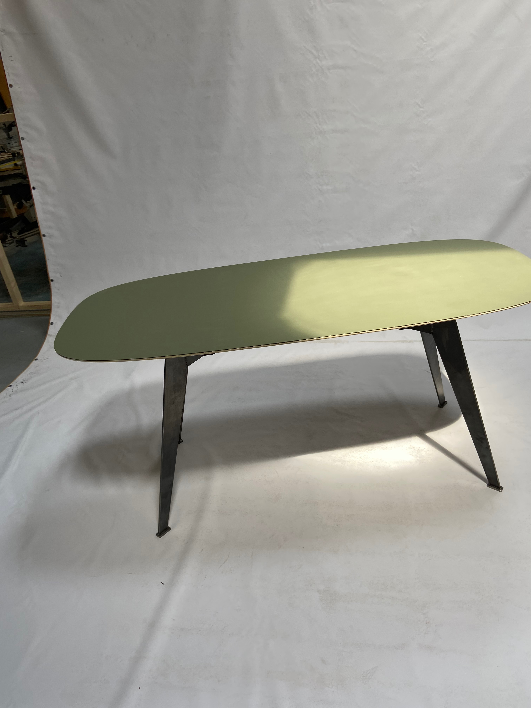

# Table nr.6 170x80 AFLab with Fiddlewood
Forbo desktop linoleum top, multiplex corpus, beech legs

&nbsp;

# Table nr.7 170x80 AFLab with Fiddlewood (steel frame)
Bezier curve. Forbo desktop linoleum top, multiplex corpus, Frame: conserved staal, waterjet cut, thickness 7 mm

